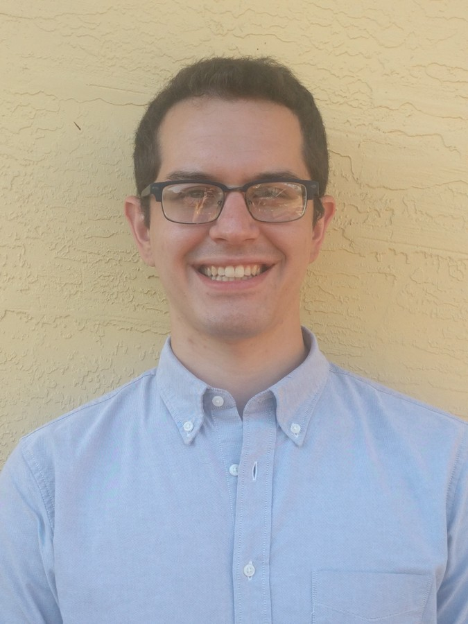

## Carlos A. Gonzalez, M.S.
Carlos is currently a graduate student at the Center for Turbulence Research at Stanford University where he works on reduced model development for laminar and transitional flows. He is an expert in numerical methods, applied math, and data analysis and is passionate about the clear and conscise communication of complicated ideas through good data visualization. 

## Richard Vazquez

## Fabiano Praca, M.S., P.E.

## Lauren Rodriguez, M.S.

## Jorge Avila 




