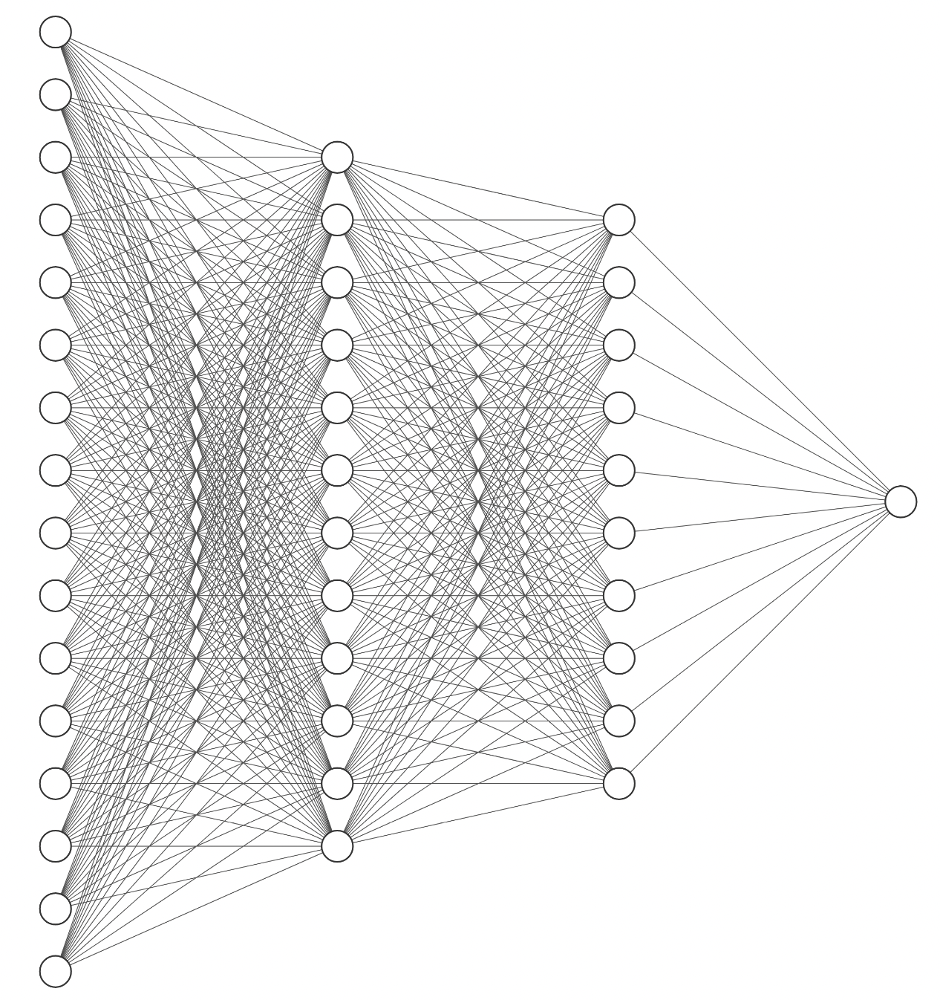

## Data Science and Visualization
    
Our data science services can help you run experiments on your data in search of new business insights. With our expertise in machine learning, artificial intelligence, and deep neural networks, we can help your company design, engineer, and deploy custom end-to-end AI products and solutions.

## Excel

We can help with custom Excel spreadsheet design, software prototypes in Excel, Excel Dashboards, and Excel automation. Simplified solutions can help your business leverage advanced Excel features to reduce your manual tasks, eliminate manual errors, and give you the time to focus on the work that matters. 

## Business Consulting

Couple of words. Figure.
